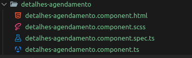
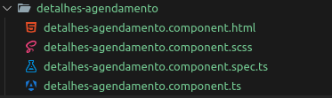
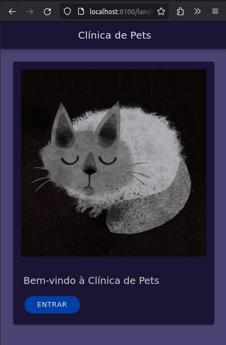
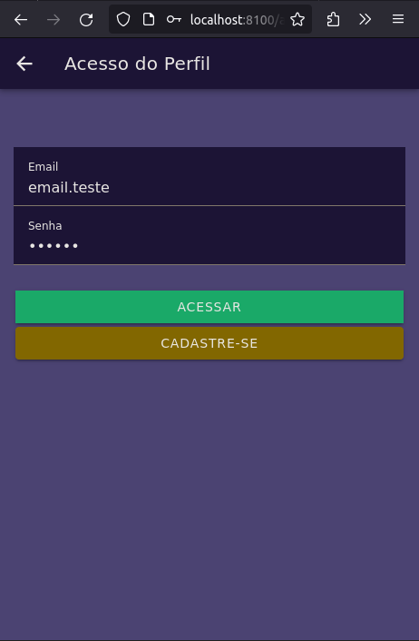
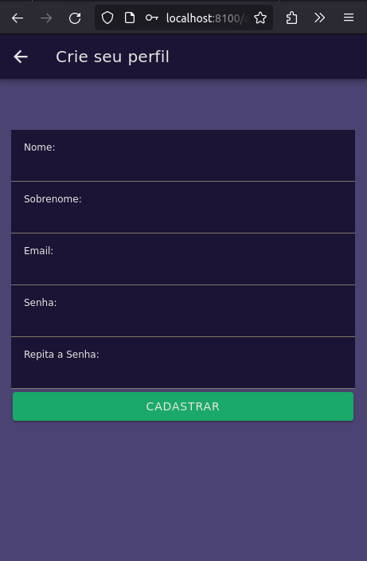
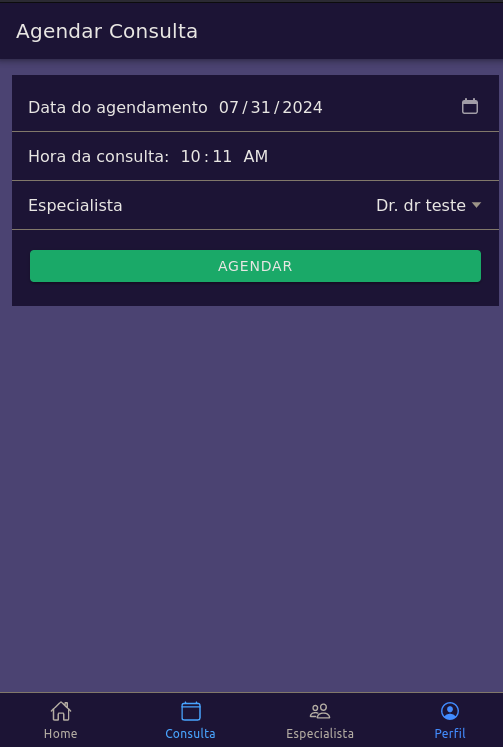
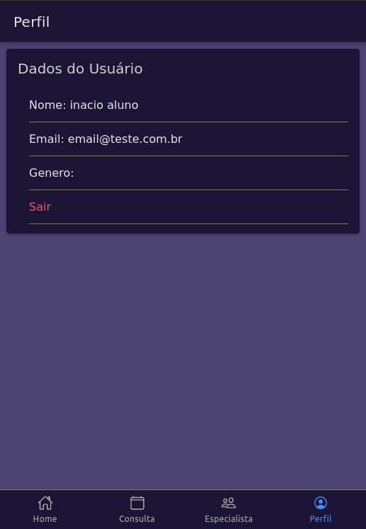
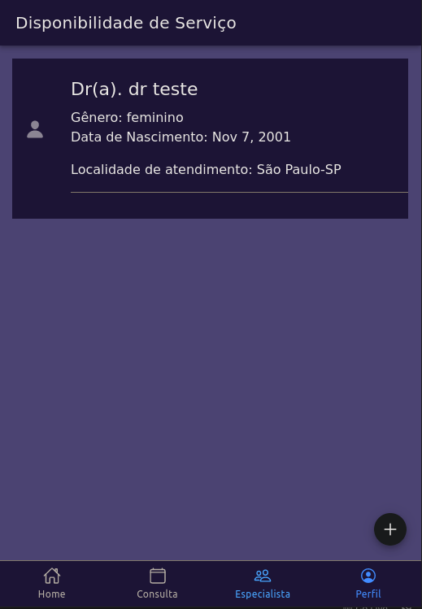
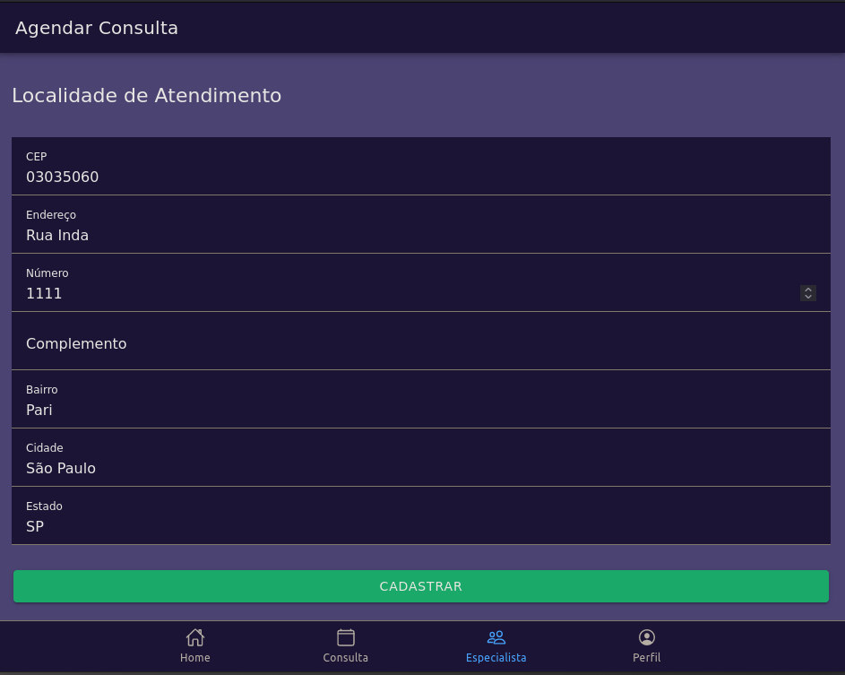

## Projeto Utilizando Ionic 7.2 + Node 21.7.1 + Angular

encontrei alguns exemplos para me basear em meu projeto de uma **Clinica de Câes e Gatos chamado 'Clínca de Pets'**
Sites analisados:

Nacionais:

- https://www.alphaveterinaria.com.br
- https://www.cobasi.com.br/petz
- http://www.arca24h.com.br/
- https://www.fullpet.com.br/
- https://petpillow.com.br/

Internacionais:

- https://vet.osu.edu/vmc/dublin
- https://www.animalhospitalofworthington.com
- https://acccw.com/
- https://www.animalcarecenterpolaris.com
- https://www.theanimalcareclinics.com/

APIS Utilizadas
Na construção desta aplicação, utilizei duas APIs, a API de CEP
para ser utilizado no cadastramento do local de atendimento do
psicólogo e uma API de gênero, para facilitar o cadastro do usuário.

**Componente criados**
Foram criados componentes para os detalhes do agendamento de consulta e
cadastro de doutores.

# telas desenvolvidas

